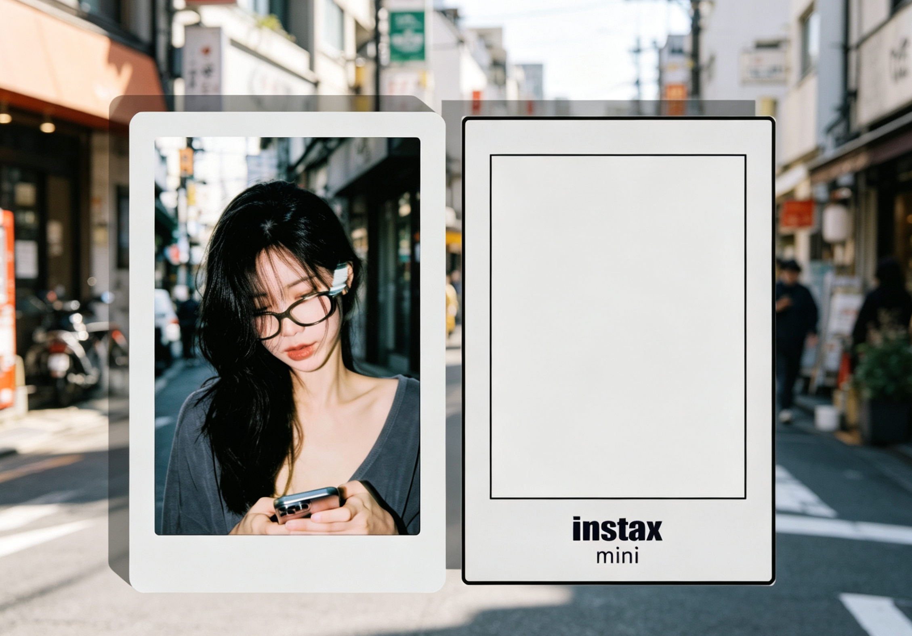

# 帧影（FrameFilm）电子胶片冰箱贴

<div align="center">



*复古胶片质感 × 电子纸显示 × 磁吸安装*

[](LICENSE)
[](https://www.espressif.com/) 

</div>

---

## 项目概述

帧影（FrameFilm）✨ 一款超有氛围感的彩色电子纸冰箱贴！📺

主打胶片复古质感，把家的仪式感拉满～轻轻一贴，定格生活每一帧的美好瞬间。💫

"帧影"寓意"一帧一影，定格时光"，英文名FrameFilm结合"帧"与"胶片"，满满的复古情怀 🎞️

## 核心功能

- 🎞️ **胶片质感呈现**：多种抖动算法加持，颗粒感满满，秒回复古胶片时代！
- 🖼️ **彩色电子纸载体**：低功耗无蓝光，阳光下也清晰，充一次电能用好几个月～
- 📱 **便捷照片传输**：蓝牙秒连手机，一键上传超方便，还能定时轮播生活瞬间！
- 🧲 **磁吸便捷安装**：背部磁铁设计，往冰箱上一贴就搞定，安装 so easy！
- ✨ **简约小巧设计**：轻薄高颜值，适配各种家居风格，摆在哪儿都是风景线！

### 固件组件

| 组件 | 说明 |
|------|------|
| `film_sys` | 系统初始化、日志、配置管理 |
| `film_service` | 核心业务服务（BLE通信、文件管理、照片播放、参数存储） |
| `film_hal` | 硬件抽象层（电子纸、电池、LED、编码器、存储） |

## 硬件规格

### FrameFilm（基础版）

| 参数 | 规格 |
|------|------|
| 主控芯片 | ESP32-S3 WROOM N16R8 |
| 显示屏 | 彩色电子纸 3.6" 600×400 (WFT驱动) |
| 存储 | TF卡 最大32GB 或 内置SDnand |
| 通信 | 蓝牙 BLE 4.2 |
| 交互 | 旋转编码器（带按键） |
| 电池 | 锂电池 304040规格 1.5mm插头 |
| 尺寸 | 约 92 × 60 × 7 mm |
| 安装方式 | 背部磁吸 磁铁 2x12mm-1mm 1x15mm-2mm |

### FrameFilm Pro

| 参数 | 规格 |
|------|------|
| 主控芯片 | ESP32-S3 mini N4R2 |
| 显示屏 | 彩色电子纸 3.68" 792×528 (SE0368-C驱动) |
| 存储 | 内置SDnand |
| 通信 | 蓝牙 BLE 4.2 / WiFi |
| 交互 | 三按键 |
| 电池 | 锂电池 244147规格 |
| 尺寸 | 约 90 × 59 × 5 mm |
| 安装方式 | 背部磁吸 magasafe磁环 |

## 硬件开源

硬件设计已在立创开源硬件平台开源：

👉 [立创开源硬件平台 - FrameFilm](https://oshwhub.com/kiritro/project_ttfkoxxv)  
👉 [立创开源硬件平台 - FrameFilmPro](https://oshwhub.com/kiritro/project_wgzqduhs)

## 项目结构

```
FrameFilm/
├── assets/                     # 资源文件
│   └── pic/                   # 产品图片和渲染图
│
├── docs/                      # 文档资料
│   ├── blecmd/                # BLE 通信协议文档
│   ├── datasheet/             # 芯片和模块数据手册
│   ├── film/                  # film 文件格式规范
│   └── hardware/              # 硬件规格说明文档
│
├── firmware/                   # 设备固件 (ESP-IDF)
│   └── frame_film/
│       ├── components/
│       │   ├── film_service/  # 服务层
│       │   ├── film_sys/      # 系统层
│       │   ├── film_hal/      # 硬件抽象层
│       └── main/              # 主程序
│
├── hardware/                   # 硬件设计
│   ├── pcb/                   # PCB 电路原理图
│   └── model/                 # 外壳 3D 模型
│
├── tools/                      # 开发工具
│   ├── convert/               # 照片转换工具
│   ├── ForFilm/               # Web 端相框管理工具
│   └── wechart/               # 微信小程序
│
├── README.md                   # 项目说明文档
└── LICENSE                     # 许可证
```

## 快速开始

### 固件开发

1. **环境要求**
   - ESP-IDF v5.3+

2. **编译固件**
   ```bash
   cd firmware/frame_film
   idf.py build
   ```

3. **烧录固件**
   ```bash
   idf.py flash monitor
   ```

### 照片转换

#### ForFilm
ForFilm Web 工具，支持以下功能：

- **照片格式转换** - 将普通照片转换为 .Film 格式文件
- **蓝牙连接** - 与 FrameFilm 设备通过蓝牙连接实现控制和文件传输管理
- **OTA升级** - 无线更新设备固件
- **抖动效果调整** - 实时调整照片转换参数和抖动效果

**在线工具（GitHub Pages）：**
👉 [FrameFilm Web 工具](https://kirmisaki.github.io/FrameFilm/tools/ForFilm/)

#### 微信小程序

FrameFilm 微信小程序，方便在手机端管理和传输照片：

- **蓝牙连接** - 连接 FrameFilm 设备进行通信
- **相框管理** - 管理多个相框设备
- **照片传输** - 从手机相册上传或直接拍照发送到设备
- **手绘创作** - 在手机上手绘图案并发送显示

**小程序码，扫码即可体验。**  


## 开发指南

详细的开发文档请参考各模块 README：

- [固件开发](firmware/README.md) - ESP32 固件代码开发
- [硬件设计](hardware/README.md) - PCB 和外壳设计文件
- [工具使用](tools/README.md) - ForFilm Web 工具和辅助脚本
- [微信小程序](tools/wechart/README.md) - 小程序源码

技术文档目录：

- [docs/blecmd/](docs/blecmd/) - BLE 通信协议文档
- [docs/film/](docs/film/) - Film 文件格式规范
- [docs/hardware/](docs/hardware/) - 硬件规格说明
- [docs/wifi/](docs/wifi/) - WiFi 功能说明（Pro 版）

## 开源许可

本项目基于 [GNU General Public License v3.0 (GPLv3)](LICENSE) 开源。

## 致谢

- [ESP-IDF](https://github.com/espressif/esp-idf) - ESP32 开发框架
