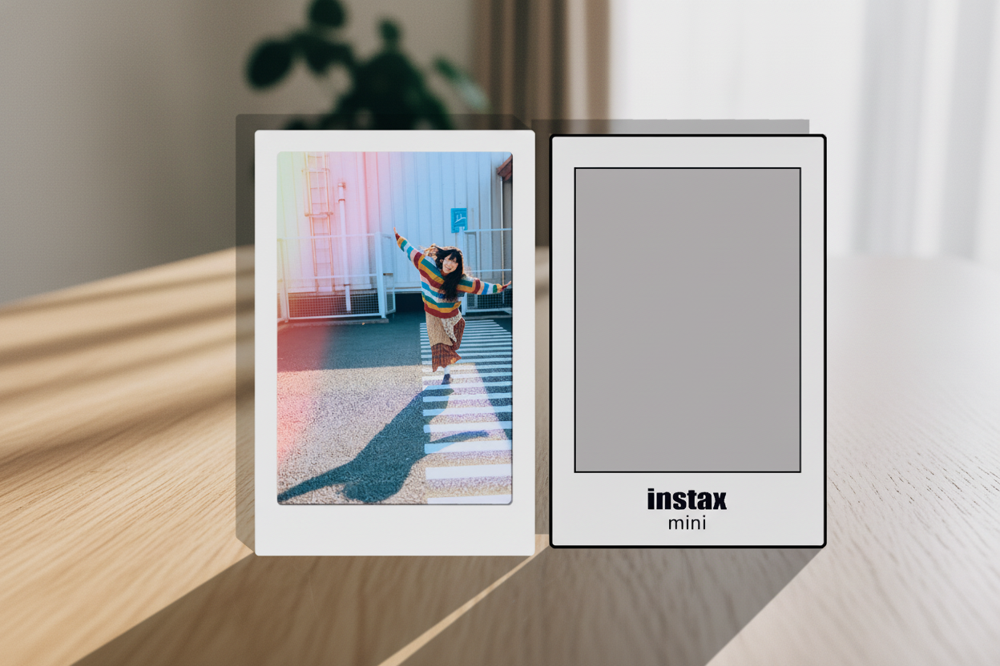
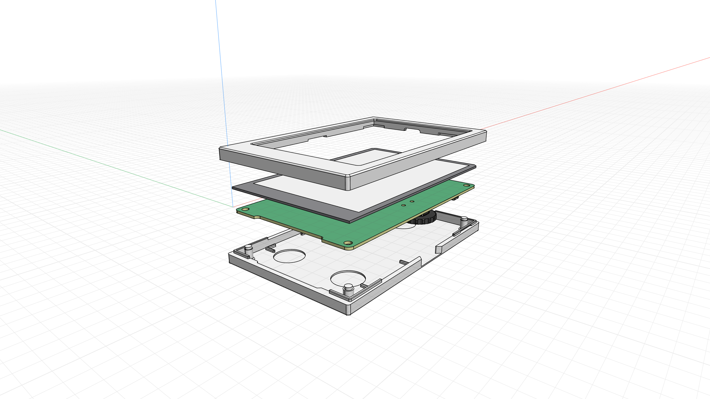
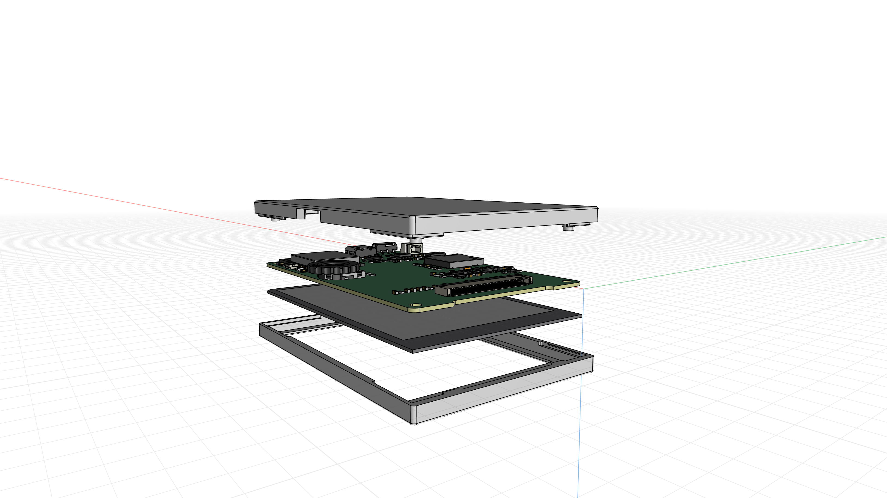

# 帧影（FrameFilm）电子胶片冰箱贴

<div align="center">



*复古胶片质感 × 电子纸显示 × 磁吸安装*

[](LICENSE)
[](https://www.espressif.com/)

</div>

---

## 项目概述

帧影（FrameFilm）是一款以彩色电子纸为载体、主打胶片复古质感的电子冰箱贴，融合复古美学与便捷展示功能，为家居场景注入仪式感，定格生活美好瞬间。

"帧影"寓意"一帧一影，定格时光"，英文名FrameFilm结合"帧"与"胶片"，传递核心价值。

## 产品展示

| 正面视图 | 侧面视图 |
|:--------:|:--------:|
|  |  |

## 核心功能

- **胶片质感呈现**：内置多种经典胶片滤镜，还原胶片颗粒感与细腻质感，区别于普通电子屏显示
- **彩色电子纸载体**：低功耗、无蓝光，视觉接近纸质照片，强光下清晰可见，充电一次可使用数月
- **便捷照片传输**：蓝牙连接手机，一键上传、批量导入，支持定时轮播多张照片
- **磁吸便捷安装**：背部强力磁铁，可吸附于铁质表面，安装灵活，不损伤家具
- **简约小巧设计**：机身轻薄，适配多种家居风格，兼具颜值与实用性

## 技术架构

```
┌─────────────────────────────────────────────────────────┐
│                    FrameFilm 系统架构                      │
├─────────────────────────────────────────────────────────┤
│  ┌─────────────┐  ┌─────────────┐  ┌─────────────┐     │
│  │  film_app   │  │ film_service │  │  film_sys   │     │
│  │  (应用层)    │  │  (服务层)    │  │  (系统层)    │     │
│  └──────┬──────┘  └──────┬──────┘  └──────┬──────┘     │
│         └────────────────┼────────────────┘             │
│                          │                              │
│  ┌───────────────────────┴───────────────────────────┐  │
│  │                    film_hal                        │  │
│  │                   (硬件抽象层)                      │  │
│  ├─────────┬─────────┬─────────┬─────────┬─────────┤  │
│  │  EPD    │   BAT   │  LED    │ENCODER  │   SD    │  │
│  │(电子纸)  │ (电池)  │  (灯)   │ (编码器) │ (存储)  │  │
│  └─────────┴─────────┴─────────┴─────────┴─────────┘  │
│                          │                              │
│                    ┌─────┴─────┐                       │
│                    │   ESP32   │                       │
│                    └───────────┘                       │
└─────────────────────────────────────────────────────────┘
```

### 固件组件

| 组件 | 说明 |
|------|------|
| `film_sys` | 系统初始化、日志、配置管理 |
| `film_service` | 核心业务服务（BLE通信、文件管理、照片播放、参数存储） |
| `film_hal` | 硬件抽象层（电子纸、电池、LED、编码器、存储） |
| `film_app` | 应用程序入口 |

## 硬件规格

| 参数 | 规格 |
|------|------|
| 主控芯片 | ESP32-D0WDQ6（双核，Wi-Fi + 蓝牙） |
| 显示屏 | 彩色电子纸（E-Ink）3.7" |
| 存储 | SPI Flash |
| 通信 | 蓝牙 BLE 4.2 |
| 电池 | 锂电池（可充电） |
| 尺寸 | 约 120 × 80 × 15 mm |
| 重量 | 约 150g（含电池） |
| 安装方式 | 背部磁吸 |

## 项目结构

```
FrameFilm/
├── assets/                    # 资源文件
│   └── pic/model/            # 产品图片和渲染图
│
├── docs/                      # 文档资料
│   ├── api/                   # API 接口文档
│   ├── design/                # 设计文档和原型图
│   ├── user-guide/            # 用户使用手册
│   └── development/            # 开发文档
│
├── firmware/                   # 设备固件 (ESP-IDF)
│   └── frame_film/
│       ├── components/
│       │   ├── film_sys/      # 系统层
│       │   ├── film_service/  # 服务层
│       │   ├── film_hal/      # 硬件抽象层
│       │   └── film_app/      # 应用入口
│       └── main/              # 主程序
│
├── hardware/                   # 硬件设计
│   ├── pcb/                   # PCB 设计文件
│   ├── schematics/           # 电路原理图
│   ├── 3dmodels/              # 外壳 3D 模型
│   ├── bom/                   # 物料清单
│   ├── datasheets/            # 芯片数据手册
│   └── gerber/                # PCB 加工文件
│
├── tools/                      # 开发工具
│   ├── convert/               # 照片转换工具
│   │   ├── convert_tool.html  # 照片转 Film Web 工具
│   │   ├── analyze_image.py   # 图片分析脚本
│   │   └── image_h/           # 转换后的图片数据
│   ├── flash/                 # 固件烧录工具
│   ├── debug/                 # 调试工具
│   └── production/            # 生产测试工具
│
├── README.md                   # 项目说明文档
└── LICENSE                     # MIT 许可证
```

## 快速开始

### 固件开发

1. **环境要求**
   - ESP-IDF v4.4+
   - Python 3.8+
   - GNU Make

2. **编译固件**
   ```bash
   cd firmware/frame_film
   idf.py build
   ```

3. **烧录固件**
   ```bash
   idf.py flash monitor
   ```

### 照片转换

使用 Web 工具将照片转换为 FrameFilm 格式：

```bash
# 直接在浏览器打开
open tools/convert/convert_tool.html
```

支持的滤镜效果和转换参数可在工具界面中实时调整。

## 适用场景

- **家庭场景**：展示家人合照、成长瞬间，打造有温度的家居角落
- **办公场景**：吸附于铁质文件柜，展示照片、语录，缓解工作压力
- **礼品场景**：作为小众有质感的伴手礼，传递美好心意

## 开发指南

详细的开发文档请参考 [docs/](docs/) 目录：

- [固件开发](firmware/README.md)
- [硬件设计](hardware/README.md)
- [工具使用](tools/README.md)

## 开源许可

本项目基于 [MIT License](LICENSE) 开源。

## 致谢

- [ESP-IDF](https://github.com/espressif/esp-idf) - ESP32 开发框架
- [LVGL](https://lvgl.io/) - 图形库（备选）
